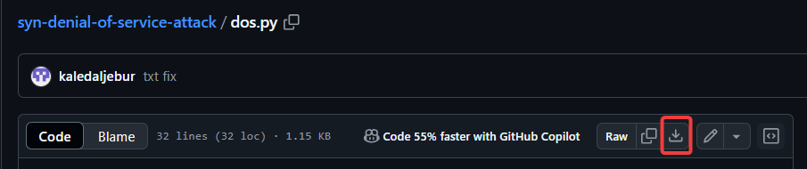

- This is for Vu23215 AT2 Part2 Activity5 - questions e and f.
- Download the [Python file](https://github.com/kaledaljebur/syn-denial-of-service-attack/blob/main/dos.py) into Kali's Desktop.
    - Click on the above link, then click on ***Download raw file***:
    
- Implement the following:
    - ***cd Desktop***
    - ***sudo python ./dos.py 192.168.1.2 192.168.1.200 80 10***
    - Notice:
        - ***sudo python ./dos.py*** is to run the file.
        - ***192.168.1.2*** is the attacker or fake IP.
        - ***192.168.1.200*** is victim IP.
        - ***10*** number of attacking packets (small number for quick testing). 

Ask your teacher if you have any questions.